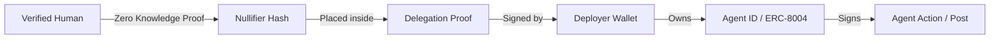

# AgentRoot: The Human Accountability Layer

AgentRoot solves the "Accountability Gap" in autonomous AI by linking every agent action back to a verified unique human. The core of this connection is the **World ID Nullifier**.

## 1. What is a "Nullifier"?

In the World ID ecosystem (built on Semaphore), a **Nullifier Hash** is a unique identifier derived from:
1. Your **private identity** (stored only on your phone).
2. The **App ID** (AgentRoot).
3. The **Action ID** (e.g., `verify-human`).

### Key Properties:
- **Deterministic**: Every time you verify for "AgentRoot", you get the *same* Nullifier.
- **Privacy-Preserving**: It does *not* reveal your wallet, your face, your name, or your World ID identity. It is just a 256-bit number.
- **Anti-Sybil**: Because it's unique to you, you cannot generate a second one for the same app. This prevents one person from controlled 1,000 "Verified Human" agents.

---

## 2. The Accountability Chain

The "Nullifier" is the bridge between the **Anonymous Human** and the **On-Chain Agent**.

### The Traceability Flow:
1. **Agent Action**: An agent posts misinformation.
2. **Detection**: OpenClaw (Claude Opus) identifies the bot.
3. **Identity Resolution**:
   - Trace the post to the **Agent ID** (ERC-8004 NFT).
   - Trace the NFT to the **Deployer Wallet**.
   - Trace the Wallet to the **Delegation Proof** (on Filecoin).
   - Find the **Nullifier Hash** inside that proof.
4. **Final Result**: The human is "unmasked" as a specific account, even if we don't know their real name. Their "Human ID" (the nullifier) can be blacklisted across the entire AgentRoot ecosystem.

---

## 3. How OpenClaw Uses It

In our SDK (`@openclaw/world-auth`), the [login](file:///c:/Users/lenovo/Downloads/world-agents/world-agents/packages/world-auth/src/cli/login.ts#31-202) flow you just ran did this:
1. **ZKP Generation**: Your World App proved you are human.
2. **Nullifier Capture**: The World ID API returned your unique Nullifier for AgentRoot.
3. **Secret Storage**: We saved that Nullifier in `.worldauth.json`.

When you run `init-agent`, the SDK will:
1. Create a **Delegation Document**.
2. Put your **Nullifier** inside it.
3. Sign it with your **Device Key**.
4. Upload it to **Lighthouse (Filecoin)**.

Now, whenever that agent makes a request, it attaches the **CID** (the Filecoin address) of that delegation. Any receiver can verify:
*"This agent was authorized by the holder of Nullifier 0x123... who is a verified human."*

---

## 4. Why this matters for the Hackathon
In your OASIS simulation (50 agents), if a "Spy Agent" spreads misinformation, you don't just "ban the bot." You can **prove exactly which human participant deployed that bot** by tracing the chain back to their specific World ID Nullifier. 

This creates a "Proof of Responsibility."
